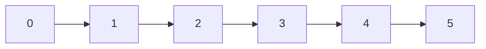

## Big O Notation

The notations which we used to determine the complexity of the algorithm are

- O(1) - Constant time complexity (Big O Notation)
- O(log n) - Logarithmic time complexity
- O(n) - Linear time complexity
- O(n log n) - Linearithmic time complexity
- O(n^2) - Quadratic time complexity
- O(2^n) - Exponential time complexity
- O(n!) - Factorial time complexity

Lets understand _Big O Notation_
in this we have

1. Big O notation
2. Omega notation
3. Theta notation

- 1. Big O notation
     we means that the maximum time the algorithm can take (It is the worst case). When you say Big O you are giving thw worst case complexity
     Worst case means : Maximum time it will take but not more than this
     we also say it as "Upper bound"

- 2. Omega notation
     we means that the minimum time the algorithm can take (It is the best case).
     we also say it as "Lower Bound"

- 3. Theta notation
     we means that the average time the algorithm can take (It is the average case).
     we also say it as "average case"

#### O(1) - Constant time complexity

This algorithm is going to take the constant time

#### O(n) - Linear time complexity

This algorithm is going to take the "n" number of times and the "n" means : whatever is the input , How many times or How many operations or the statement is running
In this the algorithm is depends on the input size



#### O(n log n) - Linearithmic time complexity

This algorithm is going to take the "n log n" number of times and the "n log
n" means : whatever is the input , How many times or How many operations or the statement is

It is an logarithmic complexity, this we will explain in the binary search

#### O(n^2) - Quadratic time complexity

If you are running one for loop from 0 to N and inside this for loop you again running the for loop from 0 to N , basically you are running for each value of i, if value of i is 0, you are running some code and times
If you run the code n \* n times which is equal to "n square" so that time you say the time complexity is "n square"

##### O(n^3) - Cubic Complexity

If you are running one for loop from 0 to N and inside this for loop you again running the for loop from 0 to N and inside this for loop you again running the for loop from
0 to N , basically you are running for each value of i, if value of i is 0, you are running some code and times
If you run the code n _ n _ n times which is equal to "n cube so that time you say the time complexity is "n cube" or "n^3" or "O(n^3)"

### Time Complexity Problems

If I say f(n) = 2(n) square + n + 10

So what is the worst case complexity of this algorithm
When you say worst case so this will take maximum time the algorithm is take that means you ignore all the lower degrees of that equation and constants means (10,2)
(When we are preparing an algorithm we dont prepare it for a very small value we assume that there can be million data on which the algorithm) so the small constant (10,2) are dont matter on the big data we dont consider this constants and from n square and n we know that n square is bigger so we dont consider lower degree also so n remove

so the worst case complexity is O(n sqaure)

### Space Complexity Problems

Suppose you have a question to find some of all elements of array
let say your array is

```bash
const a = [1,2,3,4,5];
```

Now you have to find the sum of all elements oif the array

lets say then

```bash
let sum = 0;
for(i=0; i>=sum.length;i++){
     sum = sum + a[i];
}
```

in this the time complexity is O(n) and in this it is taking some extra space where sum = 0 which is constant space and then i we are not taking any extra space to solve this question so the space complexity for this problem is O(n)

Lets talk about another problem statement
let say you have a string

```bash
const str = "Internshalla";
```
and now you want to write the algorithm to reverse the string so now you have to run a loop from end of this string
